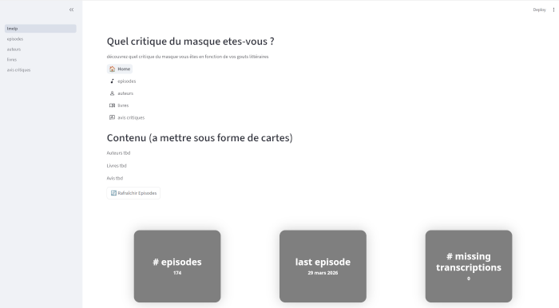

# lmelp

Projet **personnel** basé sur l'émission radiophonique du **Masque et la Plume** de France Inter.

[Le Masque et la Plume
Par Rebecca Manzoni.](https://www.radiofrance.fr/franceinter/podcasts/le-masque-et-la-plume)

**lmelp**: Ce projet intègre une **base de donnees** pour stocker les transcriptions des épisodes, les auteurs, oeuvres, éditeurs discutés lors des émissions, les avis des critiques. Une **application web** de téléchargement, transcription, visualisation des épisodes. Une **documentation** pour comprendre comment installer, utiliser et modifier ces composants.

Les projets associés sont :

- **[back-office-lmelp](https://github.com/castorfou/back-office-lmelp)** - pour travailler le contenu de la base de données.
- **[docker-lmelp](https://github.com/castorfou/docker-lmelp)** - pour héberger l'ensemble des composants dans une stack docker.
- **[lmelp-mobile](https://github.com/castorfou/lmelp-mobile)** - la version mobile android de l'application.
- **[lmelp-pap](https://github.com/castorfou/lmelp-pap)** - le Projet d'Archivage Patrimoniale (1955-2016) des épisodes du Masque et la Plume.

Tous ces projets sont basés sur le template de projet [PyFoundry](https://castorfou.github.io/PyFoundry/).
