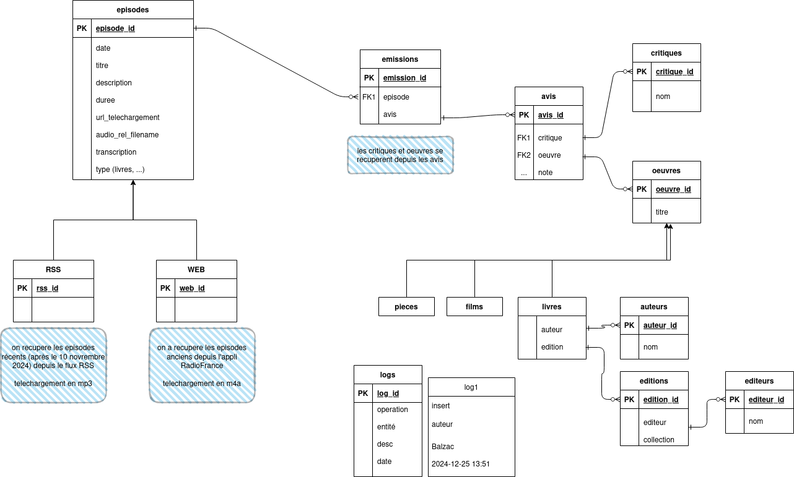

🎨 ## Data model

Here is the data model used for this application 😊
 🖼️
To edit it, I use [drawio: lmelp.drawio](https://app.diagrams.net/#Hcastorfou%2Flmelp%2Fmain%2Fdb%2Flmelp.drawio#%7B%22pageId%22%3A%22R2lEEEUBdFMjLlhIrx00%22%7D) ✏️
