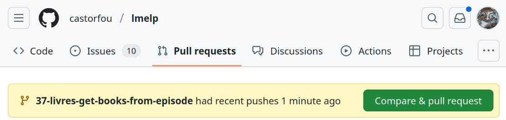

- [🚀 issue - branch - merge](#-issue---branch---merge)
  - [merge to main](#merge-to-main)
- [🤖 github actions](#-github-actions)

# 🚀 issue - branch - merge

As much as possible I want to use this approach 👍

From https://github.com/castorfou/lmelp, 🔗

- create an issue 📝
- from issue create a branch (Development > Create a branch) 🔀
- work from this branch 💻
- when satisfied merge to main (then github actions will trigger) ✅


## merge to main

from `Pull requests` tab, should automatically suggest `Compare & pull request`


then `View pull request` > `Merge pull request` > `Confirm merge` > `Delete branch`

# 🤖 github actions

configured in `.github/workflows/ci.yml` ⚙️

## Tests automatiques

Le projet dispose de tests automatiques configurés via GitHub Actions dans `.github/workflows/tests.yml` 🧪

### Configuration des tests

- **Framework** : pytest avec couverture de code
- **Environnement** : Python 3.12 sur Ubuntu Latest
- **Déclenchement** : Push et Pull Request sur toutes les branches
- **Couverture minimale** : 90% (configurable dans le workflow)

### Structure des tests

```
tests/
├── unit/                    # Tests unitaires par module
│   ├── test_config.py      # Tests nbs/config.py (97% couverture)
│   ├── test_mongo.py       # Tests nbs/mongo.py (98% couverture) 
│   ├── test_llm.py         # Tests nbs/llm.py (100% couverture)
│   ├── test_rss.py         # Tests nbs/rss.py (100% couverture)
│   └── test_fixtures.py    # Tests infrastructure données
├── integration/             # Tests d'intégration
│   └── test_workflows.py   # Tests workflows RSS→MongoDB→LLM
├── ui/                     # Tests interface utilisateur
│   └── test_streamlit.py   # Tests basiques Streamlit
└── fixtures/               # Données de test
    ├── sample_config.json
    ├── sample_episode.json
    ├── sample_transcription.txt
    └── sample_rss_feed.xml
```

### Commandes de test locales

```bash
# Tous les tests
pytest

# Tests avec couverture
pytest --cov=nbs --cov-report=term-missing

# Tests spécifiques
pytest tests/unit/test_config.py -v

# Rapport HTML de couverture  
pytest --cov=nbs --cov-report=html
# Voir htmlcov/index.html
```

### Métriques actuelles

- **Total** : 124 tests (104 unitaires + 11 intégration + 9 UI)
- **Couverture modules testés** : 98.75% moyenne
  - `config.py` : 97%
  - `llm.py` : 100% 
  - `mongo.py` : 98%
  - `rss.py` : 100%
- **Statut** : ✅ Tous les tests passent

### Intégration CI/CD

Le workflow `.github/workflows/tests.yml` :

1. **Installation** : Python + dépendances depuis `tests/requirements.txt`
2. **Exécution** : `pytest` avec couverture de code
3. **Validation** : Échoue si couverture < 90% (sur modules testés)
4. **Robustesse** : Tests depuis répertoire externe pour valider portabilité

Voir 📖 [Guide complet des tests unitaires](readme_unit_test.md) pour plus de détails.