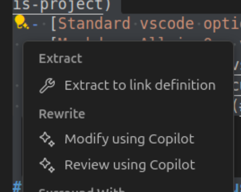

- [📘 How to properly write usefull markdown files (.md) in this project](#-how-to-properly-write-usefull-markdown-files-md-in-this-project)
  - [🛠️ Standard vscode options](#️-standard-vscode-options)
  - [✨ Markdown All in One vscode extension](#-markdown-all-in-one-vscode-extension)
    - [⌨️ shortcuts](#️-shortcuts)
    - [📑 table of contents](#-table-of-contents)
  - [😊 emojis](#-emojis)
  - [🖼️ images](#️-images)

# 📘 How to properly write usefull markdown files (.md) in this project

## 🛠️ Standard vscode options
`Ctrl-k V` to open preview to the side 👀

## ✨ Markdown All in One vscode extension
It helps with all you need for Markdown (keyboard shortcuts, table of contents, auto preview and more) 🤖

### ⌨️ shortcuts
`Ctrl-B` to toggle **bold** 💪

### 📑 table of contents
Run command "**Create Table of Contents**" (in the VS Code Command Palette) to insert a new table of contents 🔖

## 😊 emojis
Use GitHub Copilot Rewrite: Modify using Copilot 🤖

 🖼️

Select everything, modify using Copilot with this prompt ✍️

```prompt
Add nice emojis to this markdown text.
It has to be informative and helpful.
No more than 1 emoji per line.
I would like emojis at beginning of text (after #s though) for titles or sections, 
and at end of line for regular lines.
```

## 🖼️ images
put them in `docs/img` 📂
