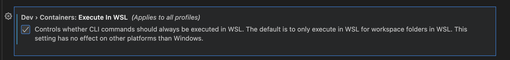

- [Vscode hints 🛠️](#vscode-hints-️)
  - [multicurseur pour remplacer des variables par ex🔄](#multicurseur-pour-remplacer-des-variables-par-ex)
  - [multicurseur sur chaque ligne d'un texte📋](#multicurseur-sur-chaque-ligne-dun-texte)
  - [cacher un repertoire du workspace (par exemple __pycache__)🙈](#cacher-un-repertoire-du-workspace-par-exemple-pycache)
  - [ajouter des sources pour pylance🔌](#ajouter-des-sources-pour-pylance)
  - [tester un petit code python en REPL 🐍](#tester-un-petit-code-python-en-repl-)
  - [editer des fichiers markdown 📝](#editer-des-fichiers-markdown-)
  - [utiliser dev container 📦](#utiliser-dev-container-)


# Vscode hints 🛠️

## multicurseur pour remplacer des variables par ex🔄

sur le mot `Ctrl-d` autant de fois que le nombre de variable à remplacer 💻

## multicurseur sur chaque ligne d'un texte📋

(pour inserer un > par ex en debut de ligne) ➡️

selection du texte puis `Shift-Alt-i` 👉

## cacher un repertoire du workspace (par exemple __pycache__)🙈

ouvrir settings.json : `Ctrl-Shift-p` et taper Preferences: Open Settings (JSON) ⚙️

ajouter une entree dans __`files.exclude`__ ➕

```
                "files.exclude": {
                                "**/.ipynb_checkpoints": true
                },
```

## ajouter des sources pour pylance🔌

ouvrir settings.json : `Ctrl-Shift-p` et taper Preferences: Open Settings (JSON) ⚙️

ajouter une entree dans __`python.analysis.extraPaths`__ ➕

```
                "python.analysis.extraPaths": [
                                "/home/guillaume/miniforge3/envs/gemini/lib/python3.11/site-packages",
                                "/home/guillaume/miniforge3/envs/whisper/lib/python3.11/site-packages"
                ],
```

## tester un petit code python en REPL 🐍

https://code.visualstudio.com/docs/python/run#_native-repl 🔗

> You can open the Native REPL via the Command Palette (Ctrl+Shift+P) by searching for Python: **Start Native REPL**. Furthermore, you can send code to the Native REPL via **Smart Send** (Shift+Enter) and Run Selection/Line in Python REPL by setting `"python.REPL.sendToNativeREPL": true` in your settings.json file. 🚀

ca fait tourner un unknown.ipnb juste a cote. 🔍

## editer des fichiers markdown 📝

[readme_markdown](readme_markdown.md) 📄

## utiliser dev container 📦

**Ressources:** 📚

- vscode doc website [Create a dev container](https://code.visualstudio.com/docs/devcontainers/create-dev-container) 📖

- youtube [Get Started with Dev Containers in VS Code](https://www.youtube.com/watch?v=b1RavPr_878&t=169s) 🎥

- youtube [Beginner's Series to: Dev Containers](https://www.youtube.com/playlist?list=PLj6YeMhvp2S5G_X6ZyMc8gfXPMFPg3O31) 🎬

**Etapes: **📝

1. installer `dev containers` extension ⬇️

2. palette: `Dev Containers: Add Dev Container Configuration Files...` using ms-python3, `Reopen in Container` 🎨

3. **extensions**: les extensions installees localement qui m'interessent pour ce projet, `Manage > Add to devcontainer.json`, et en sauvant je rebuilde le container 🔧

4. **requirements**: les lib python necessaires pour ce projet 📌

5. **postCommand.sh**: j'installe cmake et dbus (pour supprimer la mise en veille), la locale fr_FR.UTF-8 pour la conversion de dates, les libs python, pre-commit et le safe.directory git (car les utilisateurs host et docker sont differents) ⚡

6. **runArgs**: 🚀

   1. `--network=host` pour acceder au container depuis le host (pour streamlit) 🌐

   2. `--label com.centurylinklabs.watchtower.enable=false` pour exclure le container de la mise a jour watchtower 🚫

   3. `--env CONTAINER_NAME=vscode-dev-container-lmelp` pour retrouver le nom du container depuis un script execute depuis host 🆔

7. **forwardPorts** pour acceder a streamlit 🔀

8. **shutdownAction** a "none" pour empecher que le container ne s'arrete a la sortie de vscode (utile pour lancer les scripts ou streamlit)


A chaque modification, faire un `Dev Containers: Rebuild Container`. Malheureusement la construction est assez lente du a l'installation des requirements; ca sera top de pouvoir faire un `pip install --batch-download-parallelism 10` (see [PR](https://github.com/pypa/pip/pull/12923)), ou alors passer a [uv](https://docs.astral.sh/uv/) (j'ai essaye mais j'avais des problemes avec venv)

Depuis Windows+WSL, il faut activer `Dev>Containers: Execute in WSL`, cela utilisera le docker de WSL et pas le docker Windows (que je n'ai pas)



Voir dans `.devcontainer` pour le detail. 📂
